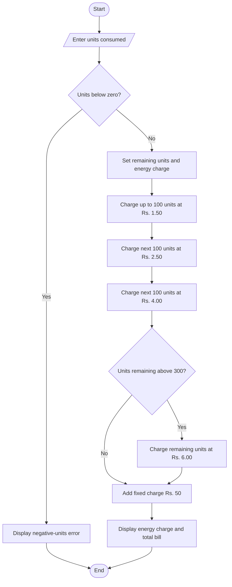

# Flowchart — Progressive Electricity Billing

This flowchart follows the logic in `main.py`.

```mermaid
flowchart TD
    A([Start]) --> B[/Enter units consumed/]
    B --> C{Units below zero?}
    C -- Yes --> D[Display negative-units error]
    D --> Z([End])
    C -- No --> E[Set remaining units and energy charge]
    E --> F[Charge up to 100 units at Rs. 1.50]
    F --> G[Charge next 100 units at Rs. 2.50]
    G --> H[Charge next 100 units at Rs. 4.00]
    H --> I{Units remaining above 300?}
    I -- Yes --> J[Charge remaining units at Rs. 6.00]
    I -- No --> K[Add fixed charge Rs. 50]
    J --> K
    K --> L[Display energy charge and total bill]
    L --> Z
```

**Key:** Oval = Start/End · Parallelogram = Input/Output · Diamond = Decision · Rectangle = Process
